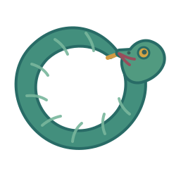

# uroboros

<p align="center">
  
</p>

[](https://github.com/ortimusirig/uroboros/actions/workflows/tests.yml) [](LICENSE)  

Claude authors plans and Codex reviews them. Codex implements in a Git-isolated workspace; Claude reviews the implementation, answering Codex corrections and rebuttals. The harness retains command evidence, complete delivered messages, decisions and dissent.

Native work uses offline [BMAD and Spec Kit workflow profiles](docs/guides/workflow-profiles.md)
for outcome planning, retained replanning, implementation and evidence review. The harness
validates and delivers pinned adaptations to both seats, preserving the captured version on
resume. Reports distinguish bound, historical unbound and invalid captures; delivery is not
proof of comprehension or quality. No upstream toolkit or additional provider round is required.

## Install

Run these two commands inside Claude Code (not a terminal):

```text
/plugin marketplace add ortimusirig/uroboros
/plugin install uroboros@uroboros
```

No clone or local installer is needed to use the plugin.

For an existing installation, run these in a terminal:

```sh
claude plugin marketplace update uroboros
claude plugin update uroboros@uroboros
```

Then restart Claude Code (or run `/reload-plugins` in the active session). For a
non-user installation, pass the matching `--scope` to the plugin update command.
Explicit plugin versions control update detection; changed commits with an unchanged
version can be skipped. See [Claude Code version management](https://code.claude.com/docs/en/plugins-reference#version-management).
These are documented update instructions, not a claim that a live update was tested.


### If you are an AI agent setting this up for someone

Follow [`skills/uroboros-setup/SKILL.md`](skills/uroboros-setup/SKILL.md), the single source of
truth for the bootstrap procedure. If this README is all you have, fetch the skill directly:
<https://raw.githubusercontent.com/ortimusirig/uroboros/main/skills/uroboros-setup/SKILL.md>.

Expected order:

1. Verify Node 24 or newer, git, the Codex CLI, the Claude CLI, and superpowers in both agents.
2. With the operator's consent, install anything missing.
3. Have the operator complete the two CLI sign-ins.
4. Install the plugin.
5. Restart the Claude Code session so its slash commands register.
6. Run the demo pass.

## First run

Plugin slash commands do not register in a Claude Code session that was already running when
the plugin was installed. After `/plugin install`, restart the Claude Code session, then run:

```text
/uroboros:setup
```

`setup` is the guided path. It checks everything the loop needs and, once the prerequisites are
green, scaffolds a throwaway demo project and executes one real pass against it. You finish
having watched an isolated worktree, recorded command evidence, a real review report and a
real diff, rather than having ticked off a checklist. The demo is written under the scratch root, never into a
project of yours.

Re-running `setup` is safe: it re-checks and skips whatever is already green.

**Sign in to Codex and Claude using their respective CLIs.** These are
interactive browser flows owned by those CLIs. In a terminal with a TTY, `setup` waits while the
operator completes them and then re-checks. Inside Claude Code there is no TTY, so `setup`
reports its `NEEDS:` summary and exits non-zero; complete the sign-ins in a terminal, then run
`/uroboros:setup` again.

If you would rather look before anything touches your machine, `/uroboros:doctor` runs the
same checks, performs disposable scratch writes, and spends no agent tokens. Add `--fix` to have it offer the
same consented installs, or `--deep` to spend a few tokens proving the signed-in Codex CLI
can actually write and the signed-in Claude CLI can actually read.

## What you need

**Node 24+, git, the Codex CLI and Claude CLI, with every seat signed
in under its own account, plus superpowers verified separately for Codex and Claude.**
`setup` and `doctor` check all of these and name what is missing,
so you should not need this section — it is here for doing it yourself, or for when something
went wrong.

Follow the [bootstrap skill](skills/uroboros-setup/SKILL.md) for installation and remediation.

Codex loads superpowers from its registry; Claude requires `.claude-plugin` plus readable skills. A run does not
install any of them. `URO_REQUIRE_SUPERPOWERS=0` is an explicit bypass for deliberate degraded
runs, and the bypass is recorded in run facts and the report.

**Everything else is optional.** GitHub publishing, Logdy, and the offline Obsidian journal
are separate add-ons. A machine with none of them has a fully working loop.

`init` creates two starter inputs without overwriting existing files. `plan.md` tells Codex
what result to produce and what must not change. `gate.json` is a JSON list of commands the
harness runs once per round as evidence: full output lands in `__uro_evidence/`, exit codes
are recorded for the seats to judge, and nothing mechanical passes or fails the change.
Replace the generated prompts and placeholder commands with the real task and project checks
before relying on the result.

## How the loop works

Each phase starts from an explicit shared-context snapshot delivered to both seats:

```text
query/goal ──► shared context ──► Claude plans ⇄ Codex reviews
                       │
                       └────────► Codex implements ⇄ Claude reviews ──► current approval/report
                                      │                    ▲
                                      └─ evidence/issues ──┘
```

Questions, inspections, challenges and rebuttals can continue without changing the artifact.
Only an explicit author/implementation step mutates it. See the [coworker-dialogue guide](docs/guides/coworker-dialogue.md).

Above one plan, `loop decompose` builds the hierarchy that feeds the loop: a project
converges into MVP-first, dependency-ordered goals, and each goal converges in turn into
the task units — `plan.md` plus `gate.json` pairs — that `loop queue` runs. A goal is
never run directly; once every one of its tasks has landed, `loop queue --accept-goal`
has Claude read the goal spec and the aggregate landed diff first-hand and judge whether
the project now delivers that goal's capability before the goal counts as achieved.

```
Project ──► goals          (loop decompose --project; MVP-first, dependency-ordered)
Goal    ──► task units     (loop decompose --goal; plan.md + gate.json each)
Task    ──► landed commit  (loop queue; evidence → debate → final landing review)
```

Choose goal and task boundaries by independently useful, testable outcomes rather than file counts,
hours, story points, or a fixed task count. See [sizing goals and task units by outcome](docs/guides/task-sizing.md)
for practical questions, an example, and retained-work replanning guidance.

Run approved plans sequentially with `loop queue`. Relative task, gate, goal-file, and output
paths are resolved beside the queue file; the current directory is the target repository.
Each unit carries either `task` plus `gate`, or `goal` plus `out`:

```json
[
  { "name": "first", "task": "plan-first.md", "gate": "gate-first.json" },
  { "name": "second", "goal": "Add the second behavior", "out": "campaign/generated/second" }
]
```

```bash
loop queue --file queue.json --mode autonomous --max-runs 3 --token-budget 50000
```

For goal units Claude authors and Codex reviews the exact goal, plan and gate artifact.
Manual disputes now save `uro-checkpoint.json`. Continue with
`node bin/loop.js resume --run <run-directory> --decision-file <answers.json>`.
An eligible saved technical pause with no human question uses
`node bin/loop.js resume --run <run-directory> --continue`. The routes are mutually exclusive;
`--continue` reconciles validated state and never retries an uncertain effect or bypasses authority,
evidence, budgets, or approval. The saved phase, workspace, mode and limits are preserved. See [manual resume](docs/guides/usage.md#manual-resume)
for the answer schema, same-workspace recovery and replay/staleness limits.

The default `--mode manual` sends unresolved disputes to the human. With `--mode autonomous`,
Codex makes final planning decisions and Claude final execution decisions. Queues inherit that
mode in both children. Current artifact approval permits execution, including reviewer approval
with retained dissent (`approved: true, converged: false`). Execution records `converged: null`
when mutual agreement was not recorded; current reviewer approval is reported separately.
Missing, malformed or quota-failed replies never approve.

Use `--claude-model sonnet --codex-model gpt-6-astra --codex-effort high` (defaults).
The executor/arbiter aliases remain with conflict detection. `--planner-model` and
`--verifier-model` are obsolete and rejected; campaign JSON uses `mode`, `claudeModel`,
`codexModel` and `codexEffort`.

Initial planning defaults to one candidate. Explicit alternatives remain available; fresh/replan
exploration currently defaults to three candidates. In both modes, substantive planning errors use
a reviewed replacement over useful retained code, evidence and history rather than a reset. Human
involvement is limited to authenticated missing decisions or unresolved manual disputes.
The queue stops on the first non-approved result. A change lands only with valid current-diff execution approval and every blocking finding resolved,
including a validated human ruling in manual mode, AND Claude, reading the diff first-hand at
landing time, approves it; a refusal or an unreachable final review always stops the queue
with the judgement recorded. Each landed unit is committed locally, nothing is pushed, and
`queue-log.jsonl` is appended beside the queue file. Use `--dry-run` to validate and
print every resolved path without starting a run or spending tokens.
The queue allows its untracked `queue-log.jsonl` and exact generated plan, gate and checkpoint
paths backed by validated queued-goal provenance, including earlier approved goals during resume.
Unrelated files and source edits remain rejected. The queue definition itself must be tracked
or kept outside the target repository.

A single `loop run` keeps product changes in an isolated workspace for review. `loop queue` is the explicit automation that applies and commits
only fully approved diffs to the clean target, one at a time.

## Why this shape

Claude and Codex alternate author and reviewer roles so the agent producing an artifact receives an independent response before work advances.

- Claude authors plans and decompositions; Codex reviews the exact requirements, plan and evidence configuration. In autonomous mode Codex settles planning disputes.
- Codex implements in an isolated workspace. Claude reads the current diff, command evidence and Codex's corrections or rebuttals. Its read-only response is a structured report and executable test bundle; the harness validates and writes files under `__uro_review/`. Reviewer tests are protected from executor edits.
- The harness runs declared commands as evidence and retains complete stdout/stderr in `__uro_evidence/`. Agents judge what those results mean. A valid bundle explicitly declares `clean`, `issues` or `inconclusive`; missing, conflicting, incomplete or failed review never implies approval.
- Blocking findings stay open until explicitly resolved or withdrawn after Codex can answer and current test evidence is available. In manual mode the human settles unresolved disputes through the saved checkpoint. A validated human ruling settles only its named current dispute; it does not waive unrelated blockers or an unavailable review.
- Autonomous execution decisions belong to Claude. It may request correction, a reviewed replacement plan or a stop. Final queue landing separately checks the current diff and records Claude's judgement before committing locally.
- Delivery, inspection, assessment, disposition and approval are separate records. Every substantive factual claim identifies evidence; a digest identifies bytes/context, not semantic truth.
- Final-review questions remain available and reviewer depth is discretionary. A sufficient already-running approval response does not require a redundant extra provider call. There is no default dialogue-call, round or elapsed ceiling; explicit budgets and operational limits remain separate.

A standalone run leaves reviewed changes in its isolate. A queue applies approved diffs to a clean target and commits them locally. Publishing is a separate explicit action.

This gives users isolated edits, independent tests, inspectable evidence and retained dissent. The costs are extra CLI usage, latency, setup and the need to supply useful requirements and checks. Independent review can still miss defects; weak evidence does not become strong evidence because two agents discussed it.

Each provider CLI owns authentication. Uroboros does not introduce an API-key integration or transfer credentials between machines. Actual billing, quotas and model availability depend on each CLI's configured login and account entitlement.

Windows is the most exercised platform in this repository. macOS and Linux use the same Node implementation, but platform-specific behavior still needs verification on the machine running it.

`loop dashboard` provides a read-only transcript and run board. Native views show the current context/recall identity, attributed questions/answers/rebuttals, issues/dispositions, evidence/inspection/assessment state, current authority/next action and separately labelled resource scopes. The board highlights active runs, unresolved decisions and retained dissent, with Active, Today and All filters. Unknown usage is not displayed as zero. When an encoded view is shortened it is visibly marked; the original message remains inspectable in `uro-runfacts.json`.

After plugin installation, these are the fifteen namespaced slash commands:

```text
/uroboros:run
/uroboros:resume
/uroboros:mutate
/uroboros:plan
/uroboros:decompose
/uroboros:queue
/uroboros:batch
/uroboros:status
/uroboros:dashboard
/uroboros:publish
/uroboros:prune
/uroboros:doctor
/uroboros:setup
/uroboros:init
/uroboros:help
```

Each is a prompt to the Claude Code controller, not a shell alias. It asks the controller to run
the corresponding real CLI command with the supplied arguments and report the child process's
true exit code. The controller must not infer success from stdout or read an exit status through
a pipe. The `run` and `batch` prompts explicitly load the governing skill law and require a
usable plan before spending tokens.

## Usage

```sh
node bin/loop.js run --task plan.md --target . --gate gate.json
node bin/loop.js mutate --target . --base HEAD   # which added lines does no test depend on?
node bin/loop.js plan --goal "Add the requested behavior" --target . --out campaign/generated/example
node bin/loop.js decompose --goal goals/G1-demo/spec.md --target .
```

For the shared-context, evidence, authority and recovery model, see
[docs/guides/coworker-dialogue.md](docs/guides/coworker-dialogue.md). For the full command surface,
every flag, campaign shape, outcome and configuration, see [docs/guides/usage.md](docs/guides/usage.md). For GitHub publishing and the confidentiality guard, see
[docs/guides/publishing.md](docs/guides/publishing.md).

## Smoke test

A `plan.md` saying *"create hello.txt containing HELLO WORLD"*, this `gate.json`:

```json
[{ "bin": "node", "args": ["-e", "process.exit(require('fs').existsSync('hello.txt')?0:1)"] }]
```

and any throwaway folder as `--target`. A current native run records command evidence and its
allowlisted `dialogue`, `resources`, current authority and next action in `uro-runfacts.json`.
Historical v1 records may instead retain findings under `debate.roundHistory`; readability of that
field does not imply native dialogue emits legacy debate rounds.


## Known gotchas

- **Never pass `--ignore-user-config` to Codex.** It discards the project trust registry and
  Codex silently goes read-only — it appears to work and writes nothing.
- **Choose a safe scratch root outside `AppData` and OneDrive.** The scratch-root guard refuses those locations. The source checkout may live elsewhere; isolated execution and test scratch directories must satisfy the guard.
- **`where codex` may list an extensionless npm shim first.** Handled: the resolver prefers a
  PATHEXT-executable variant.

## Contributor/development setup

This checkout path is only for people who intend to work on the project. If you only intend to
use uroboros, follow the marketplace install above instead of cloning the repository.

```sh
git clone https://github.com/ortimusirig/uroboros.git uroboros
cd uroboros
node install.mjs
node bin/loop.js doctor
node bin/loop.js init ../uroboros-demo
node bin/loop.js run --task ../uroboros-demo/plan.md --target ../uroboros-demo --gate ../uroboros-demo/gate.json
```

`node install.mjs` is a verifier, not a plugin installer. It validates the manifests, command and
skill layout, and payload; runs the full self-test from the checkout; reports CLI availability;
prints the two local-checkout `/plugin` commands; and finishes with `PLUGIN_STATUS=PREPARED`. It
never writes Claude Code's marketplace, plugin, or settings state. `--dry-run` performs validation
without running the self-test. CI runs that dry-run validation on every push and pull request.

If `~/.claude/skills/uroboros` or the superseded personal-skill directory exists, the verifier
warns about the duplicate, names the path, and prints the exact platform removal command. It never
removes either directory.

```
node --test
```

The test suite has zero runtime dependencies and no build step. `fixtures/` holds real captured
Codex/Claude test streams and historical Cursor NDJSON records so the parsers are tested against actual vendor
output rather than invented shapes.

See [moving between machines](docs/guides/porting.md) for moving this to another machine.

## Repository navigation

- [Documentation index](docs/README.md): current [guides](docs/guides/) and dated [historical records](docs/history/).
- [Runtime](src/) and [CLI entry point](bin/); [tests](test/) and [provider fixtures](fixtures/).
- [Plugin commands](commands/), [skills](skills/) and [plugin metadata](.claude-plugin/).
- [Implementation plans](docs/superpowers/plans/) and [design specs](docs/superpowers/specs/).
- [Campaign workboard](campaign/) and [project goals](uro-project/): tracked development records, kept in place and excluded from the verifier's readable payload.
- [Run notes](docs/runs/README.md), [optional tooling](docs/optional-tools/) and [documentation assets](docs/assets/).

## License

MIT — see [LICENSE](LICENSE).
